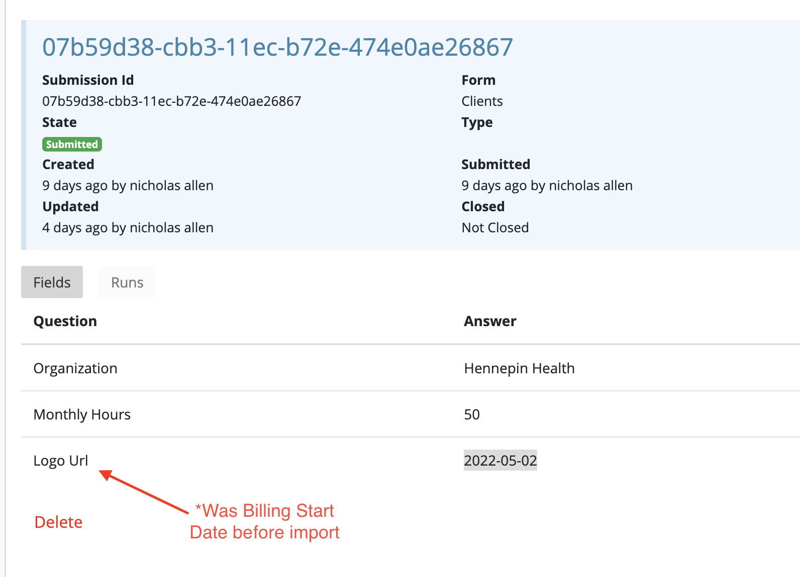

# vTEAMS Client / Fulfiller Portal

1. 

## Bugs & Questions

 ### Deployment

 - [5.13.22]: After dev => prod migration, the value from the 'f3' field on the Clients form (which previously was a Billing Start Date) was automatically mapped to the new 'f3' field, 'Logo Url.'
    

      
Example image

      
    

    - Questions: What's the best practice for keeping things in sync when the data model on prod changes? Do we need scripting to cover our bases?
 
 

## QA Testing

A client should be able to:

- [ ] Log in
- [ ] View a list of their submitted tickets
- [ ] Sort submitted tickets by Status, Date Submitted, etc.
- [ ] Submit a new Ticket

A fulfiller should be able to:

- [ ] Log in
- [ ] View a list of all tickets from all organizations
- [ ] Update the details of a ticket
  - [ ] Update the state of the ticket
  - [ ] Assign the ticket to a vTeams member
  - [ ] Adjust other details of a ticket
- [ ] Communicate with the client via comments attached to the ticket
- [ ] Log hours worked with a 'Work Log' comment
- [ ] Store private, internal notes in the comment section

## Troubleshooting

- Failed Webhook migration during export.rb run
  - Solution: Ensure the version of Ruby being used is up to date
    1. Use rvm, homebrew, etc. to install an up-to-date version of ruby
    2. (And/or) make sure that latest ruby is in the PATH
        1. `open ~/.zshrc` (or ~/.bashrc, bash_profile, depending)
        2. Add `export PATH="/opt/homebrew/opt/ruby/bin:$PATH"` and save
        3. `source ~/.zshrc`
        4. `ruby -v` to check version (should NOT be 2.6.xx)
        5. Attempt export again
